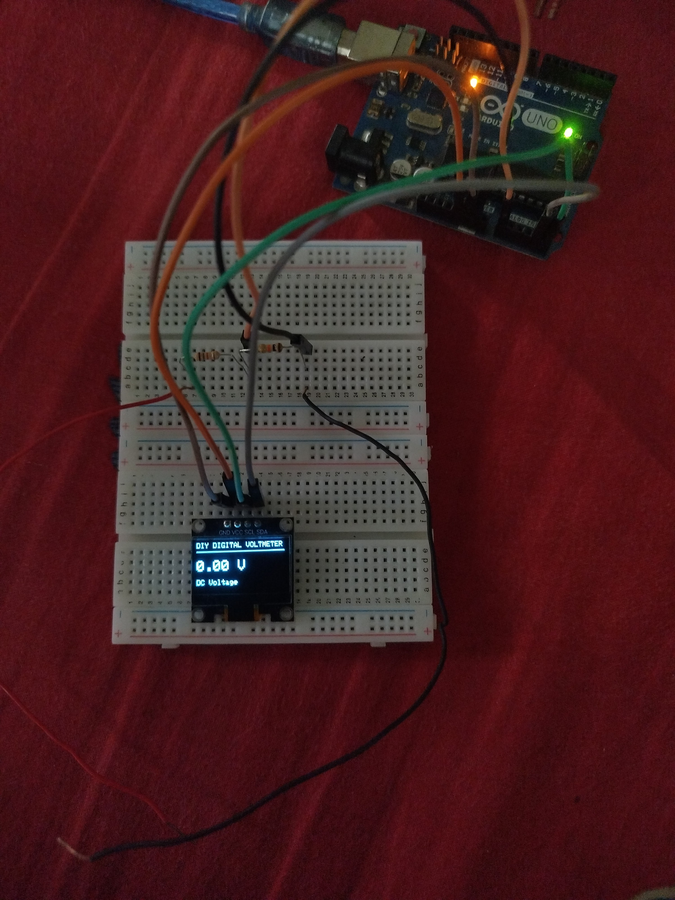
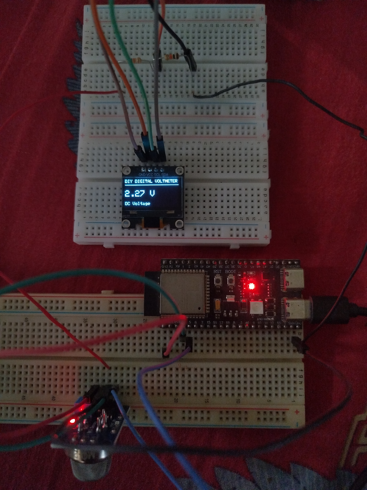

# DIY Digital Voltmeter

A simple DC voltmeter built with an **Arduino Uno**, an **SSD1306 I²C OLED**, and a two-resistor voltage divider. It continuously displays the measured voltage and shows `0.00 V` when the input is near zero.

## Features

- Continuously displays DC voltage on a 128×64 SSD1306 OLED.
- Averages multiple ADC samples to help steady the reading.
- Uses an 18 kΩ / 10 kΩ divider for measuring voltages above the Arduino's direct analog-input range.
- Intended for low-voltage electronics, sensor signals, and DC supplies up to approximately 12 V with a correctly designed and protected input.

## Components

- Arduino Uno
- SSD1306 128×64 I²C OLED module
- 18 kΩ resistor (R1)
- 10 kΩ resistor (R2)
- Breadboard and jumper wires
- Arduino USB cable
- Optional reference multimeter for calibration

## Circuit diagram

### Voltage input divider

```text
      Positive DC input (Vin)
               |
             R1 18 kΩ
               |
               +------------ Arduino A0
               |
             R2 10 kΩ
               |
      Negative DC input (Vin−)
               |
          Arduino GND
```

Connect the negative terminal of the measured source to Arduino GND. The measured source must share ground with the Arduino for this non-isolated measurement circuit.

### SSD1306 OLED to Arduino Uno

| OLED pin | Arduino Uno pin                                              |
| -------- | ------------------------------------------------------------ |
| GND      | GND                                                          |
| VCC      | 5V only if the OLED module supports 5V power; otherwise 3.3V |
| SCL      | A5                                                           |
| SDA      | A4                                                           |

The common SSD1306 I²C addresses are `0x3C` and `0x3D`. The code uses `0x3C` by default.

## Voltage-divider formula

The divider output at A0 is:

\[
V*{A0} = V*{in} \times \frac{R_2}{R_1 + R_2}
\]

Using R1 = 18 kΩ and R2 = 10 kΩ:

\[
V*{A0} = V*{in} \times \frac{10}{18 + 10}
= V\_{in} \times \frac{10}{28}
\]

Rearranging gives the input voltage:

\[
V*{in} = V*{A0} \times \frac{28}{10}
= V\_{A0} \times 2.8
\]

The Arduino estimates the voltage at A0 from its 10-bit ADC reading:

\[
V*{A0} \approx \frac{\text{ADC reading}}{1023} \times V*{ref}
\]

The sketch assumes `Vref = 5.0 V`; the actual 5V rail and resistor values may differ. Calibrate with a trusted multimeter for better accuracy.

## Software setup

1. Install [PlatformIO](https://platformio.org/) in VS Code.
2. Create a PlatformIO project for **Arduino Uno**.
3. Add the following to `platformio.ini`:

   ```ini
   [env:uno]
   platform = atmelavr
   board = uno
   framework = arduino
   monitor_speed = 115200

   lib_deps =
       adafruit/Adafruit SSD1306
       adafruit/Adafruit GFX Library
   ```

4. Put the voltmeter sketch in `src/main.cpp`.
5. Build and upload the project.

## Measurement and safety notes

- This is a **DC-only** voltmeter.
- The 18 kΩ / 10 kΩ divider scales 12 V to about 4.29 V at A0. This leaves limited headroom; do not treat 12 V as a guaranteed safe maximum if the source can fluctuate or produce transients. Design in margin and add suitable input protection before regular use.
- Never allow A0 to go below GND or above the configured ADC reference/input limit. Do not connect mains voltage.
- For a source that is disconnected, A0 can float and show noise. To obtain a reliable `0.00 V` reading, connect the input to 0 V/GND through the divider circuit rather than leaving the input open.
- For ESP32-S3 signals (normally 0–3.3 V), measure the signal relative to its ground. Never connect a 5 V Arduino output directly to an ESP32-S3 GPIO.
- The displayed result is an estimate, not a calibrated laboratory measurement. Resistor tolerances, ADC characteristics, and reference-voltage variation affect accuracy.

## Summary

This project uses an Arduino Uno's analog-to-digital converter to measure a DC voltage. An 18 kΩ / 10 kΩ resistor divider scales higher inputs down for A0, and an SSD1306 OLED continuously displays the calculated voltage. It is useful for basic electronics experiments and checking low-voltage sensor and power-supply signals.

## Photos

### Breadboarded Arduino Uno setup



*Arduino Uno, resistor divider, and SSD1306 OLED assembled on a breadboard.*

### Live voltage measurement



*The OLED displays a live 2.27 V DC reading during testing.*
